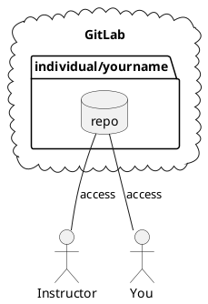
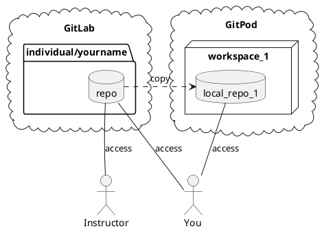
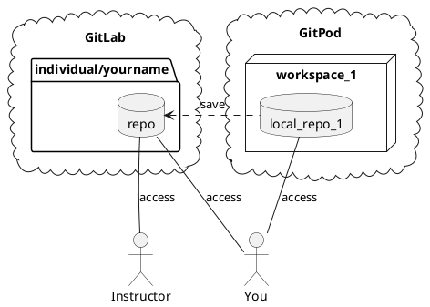

# VDI - Virtual Desktop Infrastructure

## GitLab

Your instructor will give you a repository on GitLab.
You and your instructor share this repository.
This repository is where your work will be stored
and graded.

## GitPod

You will do your work using a GitPod workspace.
When you open your repository in GitPod, GitPod
creates a workspace and copies your repository
into the workspace. A GitPod workspace is a virtual
machine that runs in the cloud. You interact with
this machine through VS Code running in a browser.

When you make changes in your workspace, those
changes are stored in your workspace and/or its
local copy of your repository. Notice that your
instructor does not have access to your workspace.
This means that they cannot grade work that is in
your workspace. To save your work to your GitLab
repository, run the `save` command in VS Code's
command-line. `save` is a special command provided
by your instructor that roughly runs the following
git commands: `git add . && git commit -m "save" && git push`.
You probably don't need this, but just in case it's
documented here.

Always confirm that your work was saved to GitLab
by opening your repository in ***GitLab***
(not GitPod) and inspecting your files.

Now that your work is in your GitLab repository,
your instructor can grade it.

## GitPod Credits

GitPod charges you for the time that your virtual
machine is running.
With a free account, you get 500 credits per month.
This gives you 50 hours per month on a standard machine.
This should be plenty of time for this course if you manage them well.
At the end of a work sessions, stop your workspace by either
running `gp stop` in VS Code's command-line.

A stopped workspace can be restarted.
Any changes you made before stopping will still be there when you restart it. But remember these changes only exist in your
workspace until you save it to your GitLab repository with `save`.

## Command: `save-and-stop`

As a convenience, your instructor has provided you with a
`save-and-stop` command. This will run both `save` and `gp stop`. Using this at the end of each work session is a
quick way to... well... save and stop.

## Command: `begin MODULE`

Your instructor will post materials to a contents repository.
You can copy modules into your workspace by running `begin MODULE` where `MODULE` is the name of the module given
to you by your instructor.

## Directory: `tmp/`

The `tmp/` directory contains files that will not be saved
to your repository. If you want something saved, make sure
you first copy or move it outside `tmp/`.
